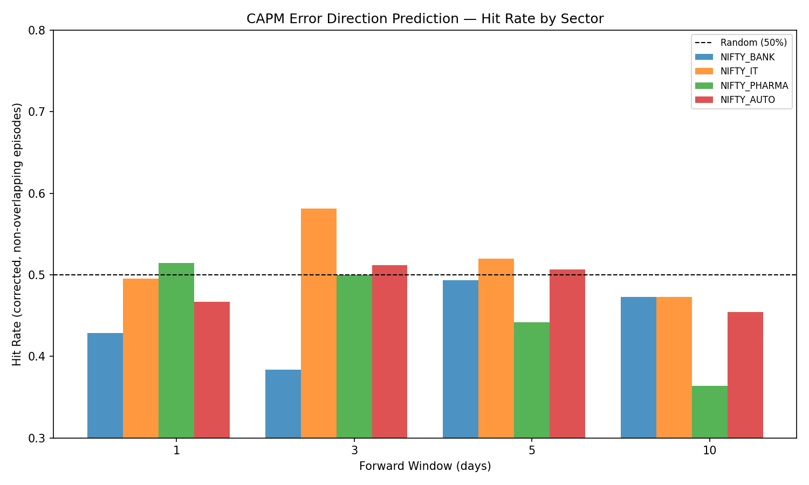

# CAPM Flow Predictor

Does daily FII/DII institutional flow divergence predict the *direction* of CAPM pricing errors in Indian equity sector indices?

**Short answer: no.** This repo contains the full pipeline, the data, and a rigorously audited null result — including the audit trail of a prior, less careful version of this analysis that turned out to have real problems (data leakage, a misreported statistic, and an ancillary finding that didn't survive a proper test). That correction history is documented in full in [`finding.md`](finding.md), Sections 7–8.

## The result, in one table

16 sector × forward-horizon combinations tested (4 sectors × 4 horizons), corrected for non-independent trials (episode-based sign test) and for multiple comparisons (Bonferroni / Benjamini-Hochberg FDR):

| Check | Result |
|---|---|
| Main test (16 cells) | **0/16 significant after correction** |
| Robustness sweep (160 parameter combos) | 5.6% significant — chance level |
| Permutation test (distribution-free) | confirms the parametric test wasn't the issue |
| Block bootstrap (regime-clustering check) | effective n ≈120 of 170, still doesn't rescue significance |
| Economic significance | Sharpe-like ratios near zero on the one borderline cell |
| F&O OI as an equity-flow proxy (ancillary check) | **no relationship** — 48.9% sign agreement on 1,750 days, chance level |



Every bar is a sector × horizon cell; the dashed line is chance. Cells scatter between 36% and 58% with no consistent direction across horizons — what noise looks like — and none survives multiple-testing correction. The tallest bar (NIFTY_IT at 3 days, 58.1%, n=86) has an uncorrected p of 0.16 and a BH-adjusted p of 0.69.

Full methodology, all numbers, and the two-round correction history: **[finding.md](finding.md)**.

## Before reading the results: the most important caveat

The target variable is the sign of the CAPM pricing error under a rolling 60-day single-factor OLS model (sector return vs. Nifty 50). Single-factor rolling CAPM on Indian sector indices is a noisy benchmark: the residual contains alpha, omitted factor exposures (size, value, momentum), and sector-specific events — not just the flow-driven mispricing this project tries to detect. A real flow effect could exist and still not register against this target, because the signal-to-noise ratio of the target variable is low.

**What this project rules out:** FII/DII flow divergence as a predictor of CAPM pricing-error *sign* under the single-factor model, 2015–2022.

**What this project does not rule out:** flows mattering for residual returns, factor-neutral returns, or intraday price impact — none of which were tested. See `finding.md` Section 6 for full scope limitations.

## Why this is a null result worth reading

Negative results in quant research are usually thrown away. This one is published because the process of getting here is itself informative:

- An earlier version of this analysis had a real out-of-sample holdout silently merged back into the training data — a textbook leakage bug that would have invalidated any "this generalizes" claim. It's fixed and the holdout is now permanently isolated in `data/holdout/`.
- A headline statistic in an earlier draft (8.1% of robustness-sweep combinations significant) didn't match the data file sitting next to it (actual: 21.25%, on the leaked dataset). That kind of stale-number drift is common and easy to miss; it's called out explicitly here.
- An ancillary finding ("F&O participant OI is a structurally inverted proxy for equity flows") was made reproducible, then found on a second, more careful pass (bigger sample, correct flow-vs-level construction) to not hold up at all — it's just uninformative, not backwards. The wrong version is documented alongside the corrected one so the mistake itself is visible.

## Repo structure

```
config.py              all tunable parameters
data_pipeline.py        L0 — market data (yfinance) + FII/DII ingestion + alignment
signals.py               L1 — flow divergence, PCR deviation, vol spread (252-day percentile)
capm.py                  L2 — rolling 60-day OLS CAPM per sector
detector.py              L3 — concordance flagging
test_prediction.py       L4 — episode-corrected sign test, walk-forward, decomposition, robustness sweep
validity_checks.py       L5 — Bonferroni/BH correction, permutation test, block bootstrap, economic significance
validate_oi_proxy.py     F&O OI proxy check (reproducible, see finding.md Section 4 for the two-round correction)
holdout_check.py         honest attempt at out-of-sample validation + documented failure mode
generate_manifest.py     SHA256 + provenance-verification status for every raw data file
run.py                   end-to-end orchestrator for the main pipeline
fetch_archives.py        NSE F&O archive fetcher (PCR only — do not use for fii_dii, see finding.md)

data/raw/                clean training data (2015-01-01 to 2022-12-08)
data/holdout/            isolated holdout segment (Aug 2025 - Apr 2026) — never merge this back into data/raw/
data/clean/              pipeline intermediate outputs
data/MANIFEST.md         data provenance — what's independently verified vs. merely declared
results/                 all output tables and plots
finding.md               the full research write-up (source of truth — see note below)
```

**Note on `finding_report.pdf` / `blog_post.pdf`:** these are point-in-time renders, not auto-generated from the current `.md` files. Last synced to `finding.md`/`blog_post.md` as of commit `1127776` (2026-06-16). `finding.md` has since gained a clean-room verification section (Section 5.6) that the PDF does not yet reflect — `finding.md` is the source of truth if the two ever disagree.

## Running it

```bash
pip install -r requirements.txt
python3 run.py                  # main pipeline: signals -> CAPM -> flags -> main test -> robustness sweep
python3 validity_checks.py      # multiple-testing correction, permutation test, block bootstrap, economic significance
python3 validate_oi_proxy.py    # F&O OI proxy check
python3 holdout_check.py        # documents why a full out-of-sample test isn't currently possible
python3 generate_manifest.py    # regenerate data/MANIFEST.md
```

All numbers in `finding.md` are generated directly by these scripts — nothing is hand-computed or pasted in.

## Independently verified

A clean-room reproducibility test was run from a fresh GitHub Codespace created directly from this public repo — no access to the original development machine, local files, or cached dependencies. After installing `requirements.txt` and running `python run.py`, the pipeline executed with no code changes, manual fixes, or undocumented setup steps, and reproduced the expected output: NIFTY_BANK at the 3-day horizon as the one sector/horizon combination significant before multiple-testing correction, matching `results/main_results.csv`'s `significant` column. (`validity_checks.py` — the step that applies the Bonferroni/BH correction and brings that down to 0/16 — was not part of this particular run; see "Running it" above to reproduce the full result.)

## Known open gaps

- **2023-2024 has zero FII/DII coverage.** This blocks a genuine out-of-sample validation against the Aug2025-Apr2026 holdout; closing it needs new data, not more code.
- **Data provenance is hashed but not all independently re-verified.** `data/MANIFEST.md` distinguishes data this pipeline re-fetches live (yfinance, verified) from data acquired manually before this repo existed (the Kaggle FII/DII CSV, declared but not independently checked against its source).
- **CAPM pricing-error sign is one specific target variable.** This project rules out flow divergence as a predictor of that target — it does not rule out flows mattering for residual returns, sector-relative returns, or factor-neutral returns, which weren't tested here.

## License

MIT — see [LICENSE](LICENSE).
